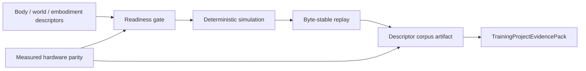

# Kuyu Physics Reliability Milestones

This document defines the local reliability ladder for `kuyu-physics`.
`../KUYU_CAPABILITY_ROADMAP.md` owns the cross-package capability order. This
file owns the package-local sequence that must be complete before downstream
scenario, training, MLX, or app code treats physics readiness as stable.
Evidence is recorded in `RELIABILITY_EVIDENCE.md`.

## End State

`kuyu-physics` is reliable when body/world/embodiment descriptors can be
loaded, validated, simulated, replayed, persisted, and promoted across readiness
levels without hidden approximations or unmeasured hardware claims.



## Advancement Rule

New work in `kuyu-physics` should advance the first incomplete milestone unless
there is a blocking defect in an earlier milestone. A milestone is complete
only when contract, implementation, fail-closed validation, regression tests,
and evidence all agree.

| Requirement | Completion meaning |
|---|---|
| Contract | Physics-owned semantics are documented and represented by public types. |
| Runtime path | Production simulation uses the physics-owned descriptor, readiness, and replay contracts. |
| Fail-closed gate | Invalid, stale, missing, ambiguous, unsupported, or unmeasured physics evidence is rejected. |
| Regression tests | Positive and negative cases cover the physics invariant. |
| Evidence | The verification command and scoped claim are recorded. |

## Milestones

| ID | Name | Status | Purpose | Completion gate |
|---|---|---|---|---|
| KP0 | Responsibility baseline | Complete for current package-local baseline | Keep `kuyu-physics` scoped to physics, descriptor import, readiness, deterministic replay, and hardware-parity evidence. | README boundary, package-local reliability docs, split body/world/manifest/readiness validation owners, root static gate, and package-level test. |
| KP1 | Canonical quadrotor kernel | Complete for current reference and single-prop paths | Ensure fidelity rungs are views over one canonical quadrotor model rather than separate engines with drift. | Canonical kernel tests for force-term coverage, residual targets, single-prop projection, and invalid integrator/input rejection. |
| KP2 | Descriptor-driven articulated dynamics | Complete for current dynamic simulation paths | Ensure articulated simulation is driven by body/world/embodiment descriptors, not body-file order or hidden defaults. | Snapshot, actuator mapping, inertia, effort, timestep, provider ordering, split model validation files, and high-dimensional readiness tests. |
| KP3 | Contact-training readiness | Complete for current deterministic contact paths | Ensure contact training requires declared materials, supported surfaces, contact evidence, and bounded residuals. | Contact-material readiness tests, penalty/constraint replay tests, contact residual tests, unsupported-contact rejection, and high-dimensional contact replay tests. |
| KP4 | Descriptor corpus artifact | Complete for current bundled, fixture, loaded-robot producer, and split owner-file paths | Ensure descriptor-corpus acceptance can be saved, reloaded, and referenced by training without trusting in-memory state. | `DescriptorCorpusAcceptanceService`, split descriptor-corpus entry/summary/evidence/store/service files, `DescriptorCorpusAcceptanceArtifactStore`, `LoadedRobotDescriptorCorpusAcceptanceService`, positive/negative corpus tests, and project-evidence reload tests. |
| KP5 | Individual reliability baseline | Complete for current package-local baseline | Make `kuyu-physics` independently auditable before broader integration depends on it. | Root individual reliability map, README linkage, package-local evidence, static gate requirements, and package-level test. |
| KP6 | Measured hardware parity | Partial | Ensure `.hardwareParity` means measured physical evidence, not dynamic simulation success. | Split hardware calibration report schemas and validation promote matching descriptors only with measured-source provenance, timestamped sample coverage, and sensor latency coverage; missing, synthetic, incomplete, or untimestamped reports fail closed. |
| KP7 | Broader real-hardware corpus coverage | Open | Expand beyond bundled/fixture coverage into real hardware descriptor suites and sensor/latency fidelity evidence. | Descriptor-corpus summaries include multiple measured hardware entries and reload through the artifact store before downstream adoption. |

## KP0: Responsibility Baseline

Status: complete for current package-local baseline.

Owned responsibility:

| Owned | Not owned |
|---|---|
| Canonical plant dynamics, articulated simulation, sensor/actuator physics, descriptor import, readiness levels, replay checking, descriptor-corpus acceptance, and hardware calibration evidence validation | Scenario pass/fail semantics, reward functions, training loop scheduling, checkpoint selection, MLX kernels, UI state, or Manas control internals |

Acceptance evidence:

| Evidence | Required state |
|---|---|
| `README.md` | Documents physics contracts and links package-local reliability docs. |
| `RELIABILITY_MILESTONES.md` | Defines this package-local reliability ladder. |
| `RELIABILITY_EVIDENCE.md` | Records package-local verification commands and scope. |
| `../scripts/validate-unconscious-boundaries.sh` | Requires the physics reliability files, root linkage, package test command, and current evidence entry. |
| Swift safety gate | Source validation rejects `try?`, `try!`, crash-only `preconditionFailure` / `fatalError`, `DispatchQueue`, `EventLoopFuture`, and `@unchecked Sendable` in package sources through the shared Kuyu boundary gate. |

## KP1: Canonical Quadrotor Kernel

Status: complete for current reference and single-prop paths.

All reference quadrotor fidelity rungs share the same canonical state, force-term
registry, residual target semantics, and integrator boundary. Single-prop lift
is a constrained view over the quadrotor canonical model, not an independent
physics model.

Acceptance evidence:

| Invariant | Gate |
|---|---|
| Single-prop is a canonical vertical fidelity view. | `singlePropPlantUsesCanonicalVerticalFidelity`. |
| Refinement nesting matches projected high-fidelity trajectories. | `refinementNestingMatchesProjectedHighFidelityTrajectory`. |
| Residual targets equal the high/low force-term gap and exclude ignored terms. | `residualTargetEqualsHighLowForceGap` and `residualTargetExcludesIgnoredTerms`. |
| Invalid canonical kernel construction fails closed. | Canonical integrator and physics-model rejection tests for implicit terms, missing/duplicate active force terms, and invalid timesteps. |
| Full engine matches legacy RK4 under the current baseline. | `fullPlantEngineMatchesLegacyRK4WithoutAtmosphere`. |

## KP2: Descriptor-Driven Articulated Dynamics

Status: complete for current dynamic simulation paths.

Articulated runtime must derive joint order, actuator mapping, effective inertia,
limits, and provider context from descriptors. Unsupported or unstable dynamic
configuration fails readiness before simulation.

Acceptance evidence:

| Invariant | Gate |
|---|---|
| Signal ordering follows actuator signal index, not body file order. | `articulatedSimulatorOrdersProviderContextByActuatorSignalIndex`. |
| Mapped actuator attachments are applied end to end. | `articulatedSimulatorAppliesActuatorAttachmentMappingEndToEnd`. |
| Torque telemetry respects mechanical reduction and efficiency. | `articulatedSimulatorMapsActuatorTorqueUsingMechanicalReduction`. |
| Zero effort limits and prismatic effective inertia are preserved. | `articulatedSimulatorHonorsZeroJointEffortLimit` and `articulatedSimulatorUsesMassForPrismaticEffectiveInertia`. |
| Time, integrator, and actuator dynamics fail closed when invalid. | World timestep, duration, substep, and unsupported-integrator rejection tests. |
| High-dimensional unordered articulated bodies remain deterministic. | 12-axis and 48-axis signal, replay, snapshot, and performance tests. |
| Articulated runtime review remains tractable as plant execution grows. | Split files for request schema, public simulator/error shell, run orchestration, validation, descriptor binding, contact setup, logging, topology, and config hash, with root static gates enforcing the split. |

## KP3: Contact-Training Readiness

Status: complete for current deterministic contact paths.

Contact training requires explicit material coefficients, supported contact
surfaces and geometry, deterministic contact mode, contact replay evidence, and
bounded residual penetration.

Acceptance evidence:

| Invariant | Gate |
|---|---|
| Contact training requires complete body contact material coefficients. | `contactTrainingReadinessRequiresCompleteBodyContactMaterial`. |
| Penalty and constraint contact produce finite evidence and bounded residuals. | Penalty contact, constraint contact, two-axis weighted projection, and surface-pose replay tests. |
| Unsupported contact worlds fail fast. | `articulatedSimulatorRejectsUnsupportedContactWorld`. |
| Contact replay is byte-stable. | `articulatedSimulatorContactConstraintReplayIsByteStableForOneHundredRuns`. |
| High-dimensional contact stays within budget and residual limits. | `articulatedSimulatorFortyEightAxisContactConstraintPerformanceBudget`. |
| Contact solver review remains tractable as materials and geometry support grow. | Split files for solver setup, penalty contact force, constraint projection, contact evaluation, Jacobian mapping, geometry witness generation, material/surface validation, numeric helpers, and support types, with root static gates enforcing the split. |

## KP4: Descriptor Corpus Artifact

Status: complete for current bundled and fixture corpus paths.

Descriptor-corpus acceptance is the saved artifact boundary for physics
readiness. Downstream training project evidence may summarize it only when the
saved physics artifact reloads through the physics owner store and matches the
summary.

Acceptance evidence:

| Invariant | Gate |
|---|---|
| Corpus acceptance records hardware-parity gaps when measured evidence is absent. | `descriptorCorpusAcceptanceRecordsHardwareParityGap`. |
| Rigid actuator descriptors replay through owned physics paths. | `descriptorCorpusAcceptanceReplaysRigidActuatorDescriptors`. |
| Contact/material variants persist contact replay evidence. | `descriptorCorpusAcceptancePersistsContactMaterialTrainingVariant` and `descriptorCorpusAcceptancePersistsHighDimensionalContactMaterialVariant`. |
| Missing contact/material or contact replay evidence fails closed. | `descriptorCorpusAcceptanceRejectsContactTrainingWithoutBodyMaterialCoefficients` and `descriptorCorpusAcceptanceArtifactStoreRejectsMissingContactReplayEvidence`. |
| Saved summaries round-trip and reject tampering. | `descriptorCorpusAcceptanceArtifactStoreRoundTripsValidatedSummary` and `descriptorCorpusAcceptanceArtifactStoreRejectsTamperedReplay`. |
| Hardware-parity summaries persist calibration-report provenance and coverage evidence. | `descriptorCorpusAcceptanceAcceptsHardwareParityReport` and `descriptorCorpusAcceptanceArtifactStoreRejectsHardwareParityWithoutEvidence`. |
| Loaded robot descriptors can publish a saved corpus without downstream code owning physics semantics. | `LoadedRobotDescriptorCorpusAcceptanceService` with `loadedRobotDescriptorCorpusAcceptanceServiceWritesValidatedArtifact`, `loadedRobotDescriptorCorpusAcceptanceServiceRejectsEmptyRobots`, and `loadedRobotDescriptorCorpusAcceptanceServiceRejectsSymlinkedOutputEscape`. |
| Descriptor-corpus acceptance remains reviewable as hardware and contact evidence grows. | Split files for `DescriptorCorpusEntry`, `DescriptorCorpusAcceptanceSummary`, `DescriptorCorpusAcceptanceRecord`, `DescriptorCorpusHardwareEvidence`, `DescriptorCorpusReplayEvidence`, `DescriptorCorpusAcceptanceArtifactStore`, artifact-store validation, acceptance service orchestration, hardware evidence, replay evidence, and rigid actuator replay, with root static gates enforcing the split. |
| Descriptor and readiness validation remain reviewable as more robot bodies are added. | Split files for `KuyuBodyModelValidation`, `KuyuWorldModelValidation`, `KuyuRobotManifestValidation`, `ReadinessGate`, and shared validation support, with root static gates enforcing the split. |

## KP5: Individual Reliability Baseline

Status: complete for current package-local baseline.

The package is independently auditable when this file, `RELIABILITY_EVIDENCE.md`,
README linkage, root individual reliability linkage, the shared source-safety
static gate, and package-level tests all pass.

Exit criteria:

| Criterion | Evidence |
|---|---|
| The package has a current reliability target after descriptor-corpus acceptance. | This KP5 section and milestone table. |
| Root validation requires the package-local reliability map. | `../scripts/validate-unconscious-boundaries.sh`. |
| Root validation requires the root individual reliability map to name `kuyu-physics` and its test command. | `../scripts/validate-unconscious-boundaries.sh`. |
| Package-local evidence records the scoped KP5 claim. | `RELIABILITY_EVIDENCE.md` entry `2026-07-03-kp5-individual-reliability-baseline`. |
| Package source boundaries remain enforceable without downstream consumers. | `../scripts/validate-kuyu-boundaries.sh`. |
| Package tests pass through the root dispatcher. | `TEST_TIMEOUT_SECONDS=180 ../scripts/test.sh kuyu-physics`. |

## KP6: Measured Hardware Parity

Status: partial.

`.hardwareParity` is a measured physical claim. Dynamic simulation and contact
training can prepare descriptors for hardware work, but they do not prove
physical parity by themselves.

Current gate:

| Invariant | Gate |
|---|---|
| Hardware parity cannot be requested without a hardware calibration report. | `hardwareParityRejectsMissingHardwareCalibrationReport`. |
| Complete measured coverage can promote a matching descriptor to hardware parity. | `hardwareCalibrationReportUnlocksHardwareParityWhenMeasuredCoverageIsComplete`. |
| Synthetic, unmeasured, or untimestamped calibration samples are rejected. | `hardwareParityRejectsUnmeasuredCalibrationSamples` and `hardwareParityRejectsUntimestampedMeasuredSamples`. |
| Sensor-bearing embodiments cannot claim hardware parity without measured sensor latency coverage matching declared sensor latency within tolerance. | `hardwareParityAcceptsMeasuredSensorLatencyCoverage`, `hardwareParityRejectsMissingSensorLatencyCoverage`, and `hardwareParityRejectsSensorLatencyOutsideDeclaredTolerance`. |
| Saved descriptor-corpus summaries cannot claim accepted hardware parity without report identity, source, measured coverage, timestamped observed-sample coverage, sensor coverage, and hash evidence. | `descriptorCorpusAcceptanceArtifactStoreRejectsHardwareParityWithoutEvidence`, `descriptorCorpusAcceptanceArtifactStoreRejectsHardwareParityWithoutObservedSampleEvidence`, and `descriptorCorpusAcceptanceArtifactStoreRejectsHardwareParityWithoutObservedSensorEvidence`. |
| Hardware calibration report review remains tractable as joint, sensor, and contact evidence grows. | Split files for report identity, source metadata, joint calibration, sensor calibration, contact calibration, hardware-parity validation, and validation support, with root static gates enforcing the split. |

Remaining work:

| Gap | Required next evidence |
|---|---|
| Real robot reports are still thin. | Add measured physical RoArm M1 and future body reports that reload through `DescriptorCorpusAcceptanceArtifactStore`. |
| Hardware parity is not broadly corpus-backed. | Add descriptor-corpus entries whose required readiness is `.hardwareParity` and whose saved summaries are consumed by `TrainingProjectEvidencePack`. |
| Sensor/latency fidelity is still not broad across real hardware. | Sensor-bearing embodiments now require measured latency calibration records and saved sensor coverage evidence; add fresh physical captures for real sensor suites and broader multi-sensor corpus coverage. |

## Stop Rules

Stop or defer implementation work when any of these are true:

| Stop rule | Required response |
|---|---|
| A physics change succeeds only because an unsupported mode is silently approximated. | Add a readiness failure or a declared approximation policy before continuing. |
| Dynamic simulation evidence is used to claim hardware parity. | Record a hardware-parity gap until measured reports exist. |
| A descriptor corpus summary is consumed from memory only. | Persist and reload it through `DescriptorCorpusAcceptanceArtifactStore`. |
| A downstream package reinterprets physics readiness locally. | Move the check into `kuyu-physics` or consume a physics-owned artifact summary. |
| A test only proves compilation or a happy path. | Add semantic negative tests for the relevant physics invariant. |

## Verification Commands

```bash
cd /Users/1amageek/Desktop/Robot/unconscious
TEST_TIMEOUT_SECONDS=180 ./scripts/test.sh kuyu-physics
./scripts/validate-kuyu-boundaries.sh
./scripts/validate-unconscious-boundaries.sh
./scripts/audit-dangerous-code.sh --verbose
```
